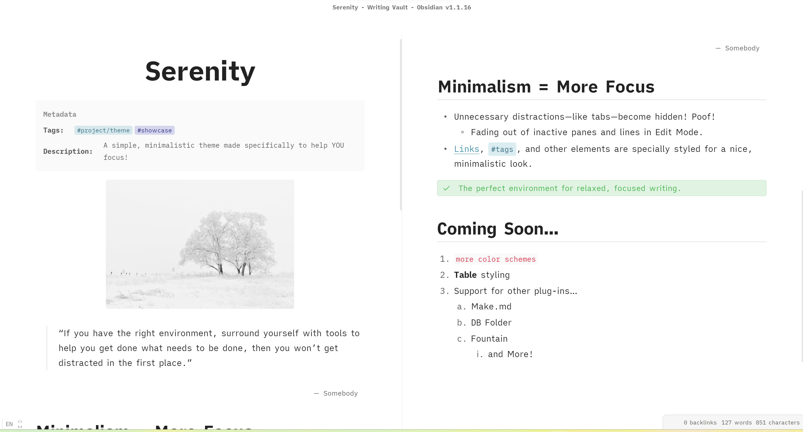
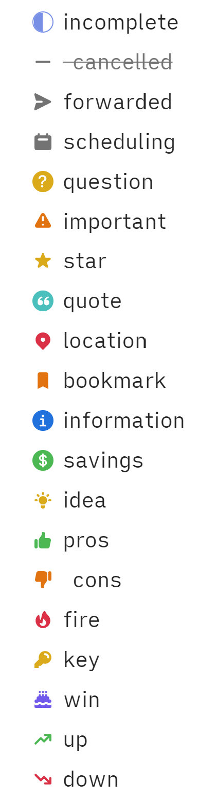
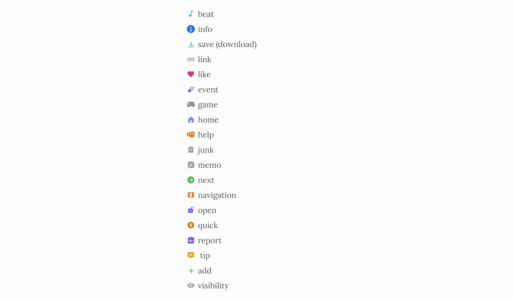
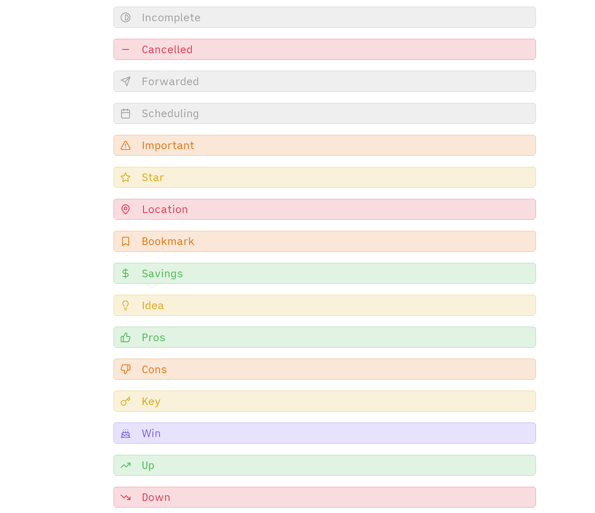

# Serenity.
> There is nothing. Only you and the words. And your mind. In *sync*.
>> All you have to do is train your mind on the words. And write.

<details> <summary> <em>Features</em> </summary>

### Custom Checklists & Callouts

#### Checkbox States
> Credit: Minimal theme
>> [Buy kepano a coffee](https://www.buymeacoffee.com/kepano)



##### Syntax
Syntax is the same as that of the Minimal theme.

```markdown
- [/] incomplete
- [-]  cancelled
- [>] forwarded
- [<] scheduling
- [?] question
- [!] important
- [*] star
- [“] quote
- [l] location
- [b] bookmark
- [i] information
- [S] savings
- [I] idea
- [p] pros
- [c]  cons
- [f] fire
- [k] key
- [w] win
- [u] up
- [d] down 
```
      
Plus some additional checkboxes.

```
- [B] beat
- [s] save (download)
- [a] link 
- [L] like
- [e] event
- [g] game
- [h] home
- [H] help 
- [j] junk
- [m] memo
- [n] next
- [N] navigation 
- [o] open
- [q] quick
- [r] report
- [t]  tip
- [+] add
- [v] visibility
```
 
      

#### Custom Callouts
> Keywords are the same as those for the checklists.
>For example, the *cancelled* callout is `>[!cancelled]` or `>[!-]`.



</details>

<details> <summary> <em>Credits</em> </summary>


-  [kepano - Minimal checkboxes](https://www.buymeacoffee.com/kepano)
- [threethan - Material Flat Theme's FAB button](https://github.com/threethan/obsidian-material-flat-theme)
- [therazam - compact settings style](https://github.com/Bluemoondragon07/Obsidian-Serenity/issues/1#issuecomment-1515320958)
- [chrisgrieser - Shimmering Focus inspiration for backlinks](https://github.com/chrisgrieser/shimmering-focus)  

</details>
