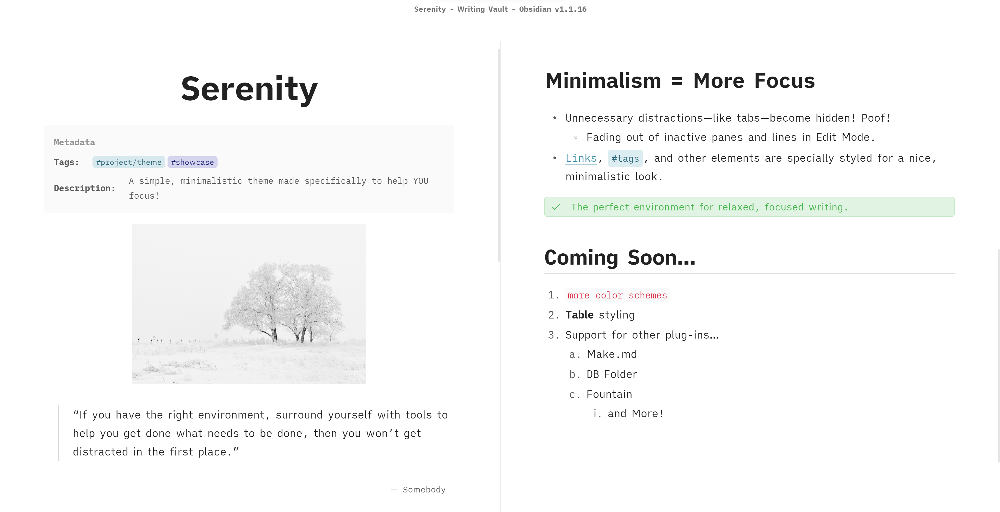
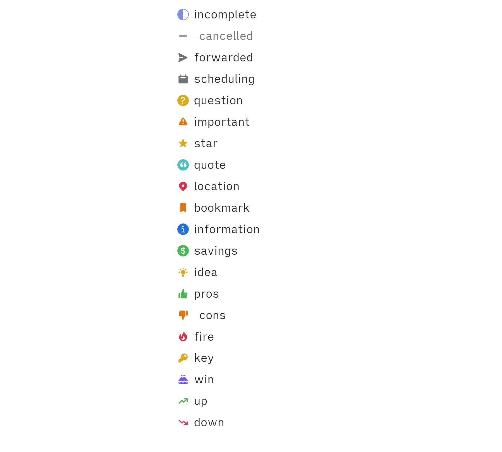

# Serenity.
> There is nothing. Only you and the words. And your mind. In *sync*.
>> All you have to do is train your mind on the words. And write.

<br>

> Important Notice Regarding Network Fonts
> Since themes are no longer allowed to use assets over the network, Serenity's style settings for additional fonts no longer work out of the box.
> BUT...
> If you would like to restore these fonts, you can use [this snippet](https://github.com/Bluemoondragon07/Obsidian-Serenity/blob/main/0%20SNIPPET%20-%20Restore%20network%20font%20list) on your vault, and the fonts will work again.

<details> <summary> Features </summary>

### Custom Checklists & Callouts

#### Checkbox States
> Credit: Minimal theme
>> [Buy kepano a coffee](https://www.buymeacoffee.com/kepano)



##### Syntax
Syntax is the same as that of the Minimal theme.

```markdown
- [/] incomplete
- [-]  cancelled
- [>] forwarded
- [<] scheduling
- [?] question
- [!] important
- [*] star
- [“] quote
- [l] location
- [b] bookmark
- [i] information
- [S] savings
- [I] idea
- [p] pros
- [c]  cons
- [f] fire
- [k] key
- [w] win
- [u] up
- [d] down 
```
      
Plus some additional checkboxes.

```
- [@] person/user
- [B] beat
- [s] save (download)
- [a] link 
- [L] like
- [e] event
- [g] game
- [h] home
- [H] help 
- [j] junk
- [m] memo
- [n] next
- [N] navigation 
- [o] open
- [q] quick
- [r] report
- [t]  tip
- [+] add
- [v] visibility
```
 
      
   
#### Speech Bubbles
> Credit: AnuPpuccin Theme
>>  [Buy Anubis a coffee](https://www.buymeacoffee.com/anubisnekhet)


##### Syntax

Syntax for individual speech bubbles is the same as that of the AnuPpuccin theme. 

```
- [0] Speech Bubble 1
- [1] Speech Bubble 2
- [2] Speech Bubble 3
- [3] Speech Bubble 4
- [4] Speech Bubble 5
- [5] Speech Bubble 6
- [6] Speech Bubble 7
- [7] Speech Bubble 8
- [8] Speech Bubble 9
- [9] Speech Bubble 10
```

###### Inside a speech bubble
The first **bold** text in a speech bubble will have its own line and will be treated like a title.

```
- [0] **Jim** Hi, I'm Jim.
```

This will have **Jim** show up as speech bubble title.
Images on the same line as the speech bubble are also supported.

#### Custom Callouts
> Keywords are the same as those for the checklists.
>For example, the *cancelled* callout is `>[!cancelled]` or `>[!-]`.


### Custom HTML Attributes


#### `data-comment`
Initiate a custom "comment" tooltip on hover.

###### Example
`<span data-comment="This is a comment">I will show a tooltip on hover!</span>`


#### `data-above`
Show 'annotations' above the text on hover.

###### Example
`<span data-above="I'm an annotation above the text!">I have annotations on hover!</span>`


#### Extra Attribute Styling

The abbreviation element (`<abbr title="This shows on hover">text</abbr>`) has some extra styling applied to it to make it stand out more.

</details>


<details> <summary>Recommended Plugins</summary

- [Focus Active Sentence](https://github.com/artisticat1/focus-active-sentence) by artistcat1 - iA Writer-like sentence by sentence focus.
- [Ninja Cursor](https://github.com/vrtmrz/ninja-cursor) by vrtmrz - activate with this theme for an iA Writer-like cursor.

</details>

<details> <summary> <em>Credits</em> </summary>


-  [kepano - Minimal checkboxes](https://www.buymeacoffee.com/kepano)
- [Anubis - AnuPpuccin Speech Bubbles](https://www.buymeacoffee.com/anubisnekhet)
- [threethan - Material Flat Theme's FAB button](https://github.com/threethan/obsidian-material-flat-theme)
- [therazam - compact settings style](https://github.com/Bluemoondragon07/Obsidian-Serenity/issues/1#issuecomment-1515320958)
- [chrisgrieser - Shimmering Focus inspiration for backlinks](https://github.com/chrisgrieser/shimmering-focus)  

</details>
